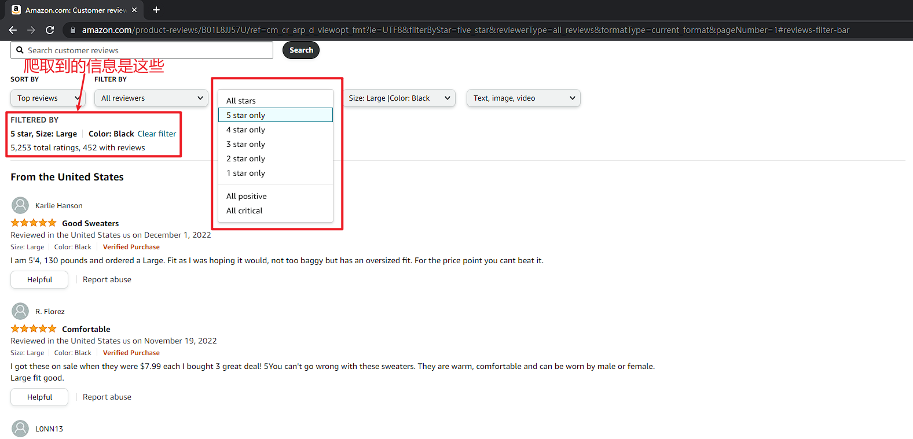
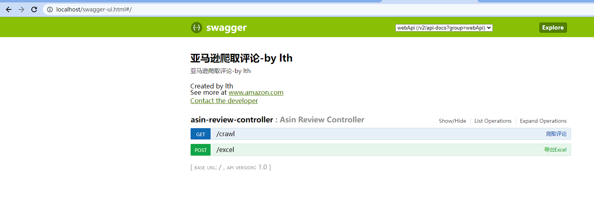
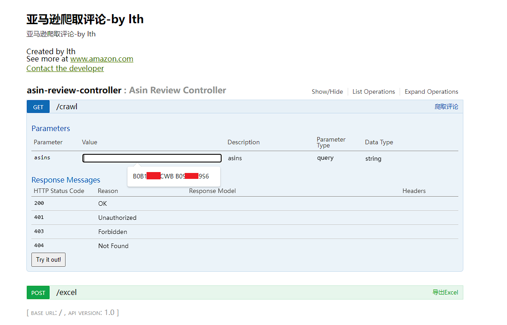
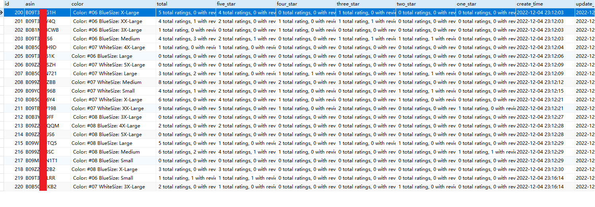
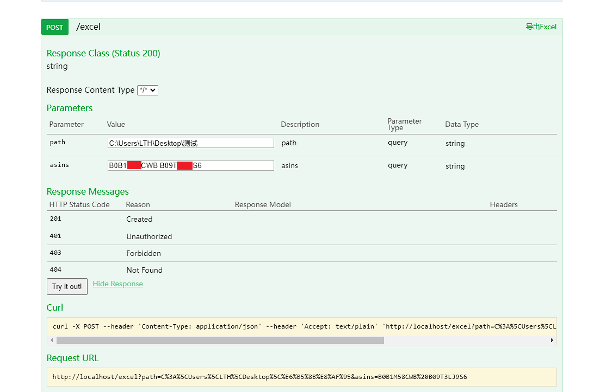
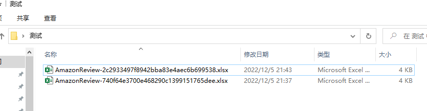
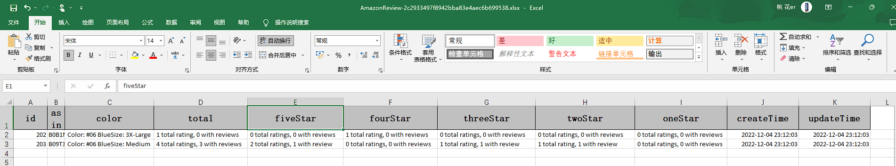

# AmazonCrawl

### 介绍

该项目用于做数据分析，查看自己店铺某个链接某个款式的数据，以便调整rating达到更高的值，从而获取更多的流量，只是作为自己使用罢了，大家可以在这上面扩展爬取更多的信息

代码质量并不是很高

**欢迎各位大佬提PR**

爬取到的信息是每个尺码，每种颜色，每个星级的细分评论



### 环境

Java 8，MySQL 8

### 使用说明

十分的简单

先创建库amazon，然后创建表，修改application.yml的数据库信息为自己的然后启动项目即可

打开swagger文档

http://localhost/swagger-ui.html



### SQL语句

```mysql
CREATE TABLE `asin_review`
(
    `id`          bigint(0)                                                     NOT NULL AUTO_INCREMENT,
    `asin`        varchar(255) CHARACTER SET utf8mb4 COLLATE utf8mb4_general_ci NULL DEFAULT NULL,
    `color`       varchar(255) CHARACTER SET utf8mb4 COLLATE utf8mb4_general_ci NULL DEFAULT NULL,
    `total`       varchar(255) CHARACTER SET utf8mb4 COLLATE utf8mb4_general_ci NULL DEFAULT NULL,
    `five_star`   varchar(255) CHARACTER SET utf8mb4 COLLATE utf8mb4_general_ci NULL DEFAULT NULL,
    `four_star`   varchar(255) CHARACTER SET utf8mb4 COLLATE utf8mb4_general_ci NULL DEFAULT NULL,
    `three_star`  varchar(255) CHARACTER SET utf8mb4 COLLATE utf8mb4_general_ci NULL DEFAULT NULL,
    `two_star`    varchar(255) CHARACTER SET utf8mb4 COLLATE utf8mb4_general_ci NULL DEFAULT NULL,
    `one_star`    varchar(255) CHARACTER SET utf8mb4 COLLATE utf8mb4_general_ci NULL DEFAULT NULL,
    `create_time` datetime(0)                                                   NULL DEFAULT CURRENT_TIMESTAMP(0),
    `update_time` datetime(0)                                                   NULL DEFAULT CURRENT_TIMESTAMP(0) ON UPDATE CURRENT_TIMESTAMP(0),
    PRIMARY KEY (`id`) USING BTREE
) ENGINE = InnoDB
  AUTO_INCREMENT = 1
  CHARACTER SET = utf8mb4
  COLLATE = utf8mb4_general_ci
  ROW_FORMAT = Dynamic;
```

爬取评论，输入asin值（多个），以xxx xxx的形式输入

可以在IDEA控制台查看爬取情况

爬取完成后可以在表中查看到数据（这里有可能出现漏一些数据的情况，原因是网络延迟，访问url超时失效了，可以使用科学工具挂全局代理会好很多，或者再调用crawl接口更新数据）


可以直接在navicat导出向导导出成Excel表格，也可以调用第二个接口来导出Excel



导出的文件




#### 免责声明，本代码仅用于学习，下载后请勿用于商业用途
